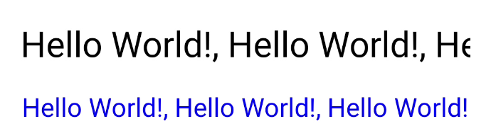

## Auto-Resized Text

Renders auto-resized text, adjusting its font size to fit within a specified minimum size.

```kotlin
AutoResizedText(
  modifier = modifier,
  text = text,
  style = style,
  minFontSize = minFontSize,
)
```

**Required:**

- **text [String]**: The text to be displayed.

**Optional:**

- **modifier [Modifier]**: The modifier to apply to this composable.
- **style [TextStyle]**: The style to be applied to the text. Defaults to the current LocalTextStyle.
- **minFontSize [TextUnit]**: The minimum font size that the text should have. Defaults to 11.sp.

### Preview


