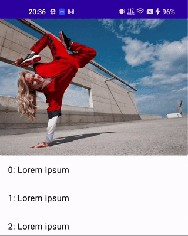

## Collapsing Toolbar

Creates a parallax effect in the app bar with an expanded background.

```kotlin
ParallaxAppBar(
  title = { /* collapsed content */ },
  expandedBackground = { /* expanded content */ },
  modifier = Modifier,
  navigationIcon = { /* icon content */ },
  actions = { /* actions content */ },
  windowInsets = windowInsets,
  colors = CollapsedAppBarColors(
    navigationIconContentColor = Color.White,
    titleContentColor = Color.White,
    actionIconContentColor = Color.White,
    containerColor = Color.Black
  ),
  collapsedAppBarHeight = 64.dp,
  titleTextStyle = titleTextStyle,
  titleVerticalArrangement = verticalArrangement,
  titleHorizontalArrangement = horizontalArrangement,
  scrollBehavior = scrollBehavior,
)
```

**Required:**

- **title [Composable]**: The content to be displayed as the title.
- **expandedBackground [Composable]**: The content for the expanded background of the app bar.

**Optional:**

- **modifier [Modifier]**: The modifier to apply to the entire app bar.
- **navigationIcon [Composable]**: The content for the navigation icon.
- **actions [Composable]**: The content for the actions in the app bar.
- **windowInsets [WindowInsets]**: The window insets applied to the app bar. Defaults to [TopAppBarDefaults.windowInsets].
- **colors [CollapsedAppBarColors]**: The color configuration for the collapsed app bar.
- **collapsedAppBarHeight [Dp]**: The height of the collapsed app bar.
- titleTextStyle The text style for the title.
- **titleVerticalArrangement [Arrangement.Vertical]**: The vertical arrangement of the title content.
- **titleHorizontalArrangement [Arrangement.Horizontal]**: The horizontal arrangement of the title content.
- **scrollBehavior [TopAppBarScrollBehavior?]**: The scroll behavior for the app bar, implementing [TopAppBarScrollBehavior].

## Preview


