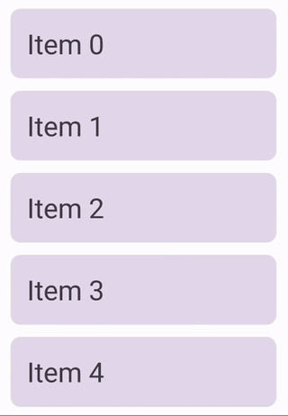

## Drag & Drop List

Enables users to rearrange and interact with items in a list by dragging and dropping them.

```kotlin
DragAndDropList(
  items = items,
  modifier = modifier,
  contentPadding = contentPadding,
  verticalArrangement = verticalArrangement,
  itemContent = { item, isDragging -> /* item content */ },
  onDragEnd = { reorderedList -> /* action */ },
)
```

**Required:**

- **items [List<T>]**: Items to display in a list.

**Optional:**

- **modifier [Modifier]**: The modifier to apply to the lazy column.
- **contentPadding [PaddingValues]**: A padding around the whole lazy column content.
- **verticalArrangement [Arrangement.Vertical]**: The vertical arrangement of the lazy column items.
- **itemContent**: A block which describes the item content.
- **onDragEnd**: Will be called when the user completes the drag gesture.

### Preview


