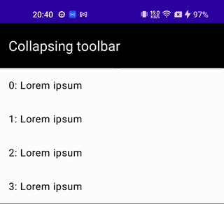

## Foldable Toolbar

A scrollable layout with a foldable toolbar effect.

```kotlin
ScrollableWithFoldableToolbar(
  toolbarHeight = toolbarHeightDp,
  topBar = { /* top bar */ },
  content = {  /* screen content */},
  modifier = modifier,
  isToolbarVisible = isToolbarVisible,
)
```

**Required:**

- **toolbarHeight [Dp]**: The height of the toolbar.
- **topBar [Composable]:** The composable representing the top bar content.
- **content [Composable]:** The composable representing the scrollable content.

**Optional:**

- **modifier [Modifier]**: The modifier to apply to the entire composable.
- **isToolbarVisible [Boolean]**: Flag indicating whether the toolbar is initially visible.

### Preview


